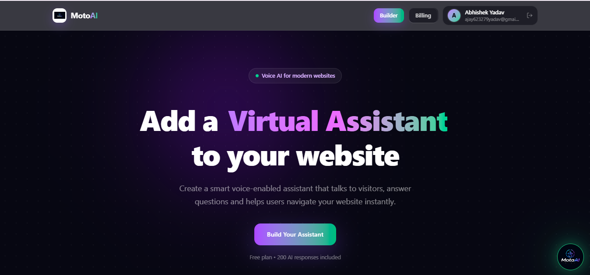
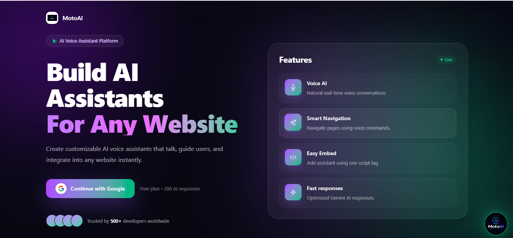
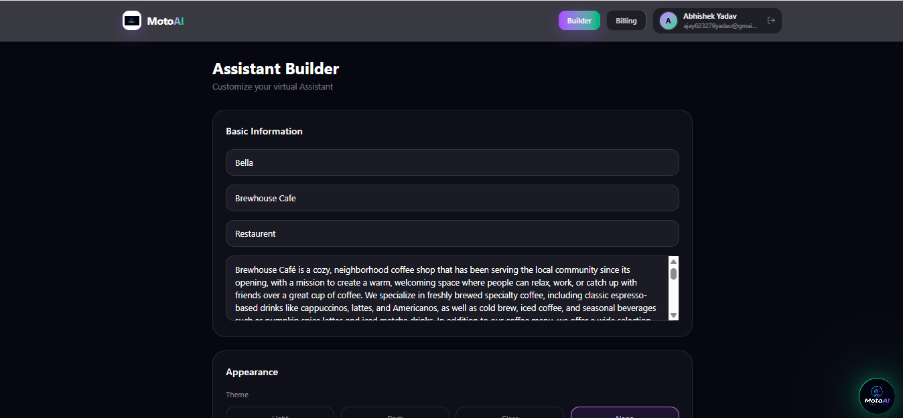
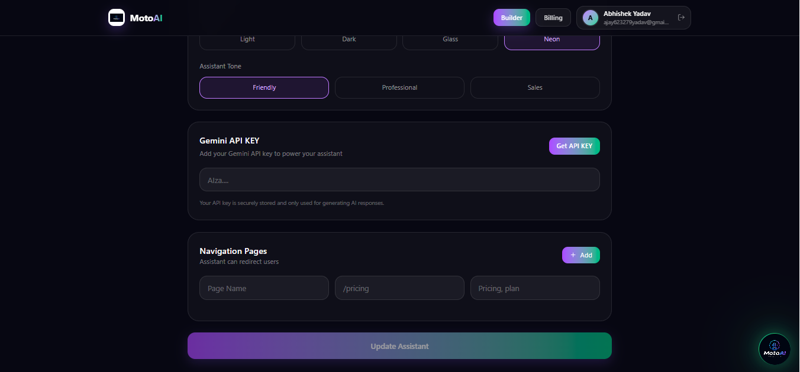
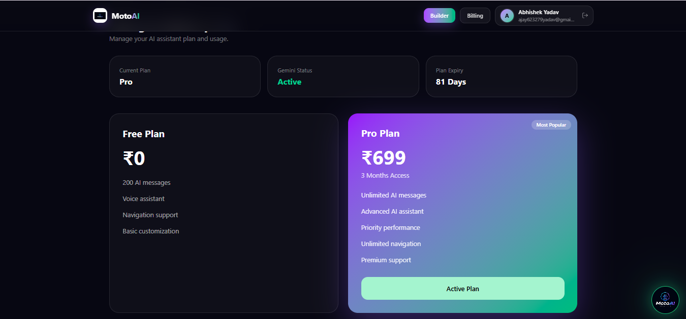
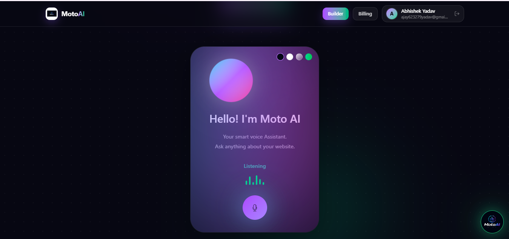
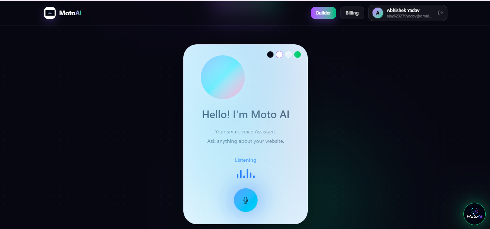
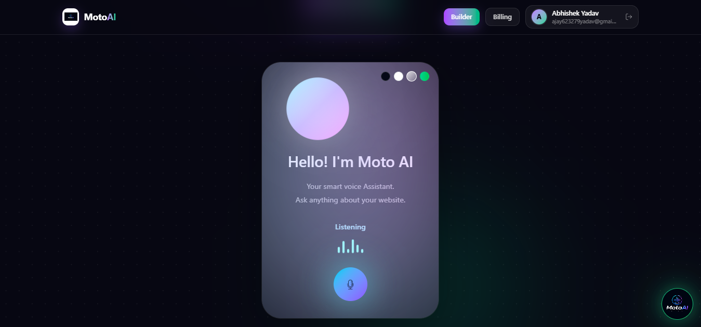
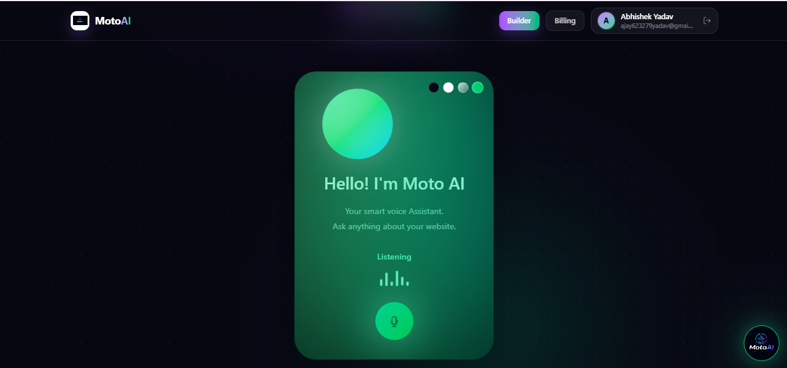

# 🚀 MotoAI – AI Virtual Assistant for Any Website

An AI-powered SaaS platform that allows website owners to embed a fully customizable, voice-enabled AI assistant into any website with just one line of code.

---

## 🌐 Live Demo

🚀 Try MotoAI Live:

https://motoai.onrender.com

---

## 🎥 Demo Video

🎬 Watch the complete project demo on LinkedIn:

https://www.linkedin.com/posts/abhishek-yadav-5635a23a4_webdevelopment-mernstack-reactjs-ugcPost-7476947322296430592-F3EH/?utm_source=share&utm_medium=member_desktop&rcm=ACoAAGMK9psBp6Xf53ExY3VHIR3MgP6WjtfIQqw

---

## 📸 Screenshots

### 🏠 Home Page

### 🔐 Login Page

### 🤖 Assistant Builder - Step 1

### 🤖 Assistant Builder - Step 2

### 💳 Billing

### 🎨 Theme 1

### 🎨 Theme 2

### 🎨 Theme 3

### 🎨 Theme 4

## ✨ Features

- 🤖 AI-powered chatbot using Google Gemini
- 🎤 Voice input and voice output
- 🌐 Smart website navigation using voice commands
- 🎨 4 Premium themes (Dark, Light, Glass, Neon)
- 🔑 Google Authentication with Firebase
- 💳 Razorpay subscription integration
- 📦 One-line embeddable JavaScript widget
- 🔒 Secure JWT Authentication
- 📊 Free & Pro subscription plans
- ⚡ Fast and responsive React UI

---

## 🛠️ Tech Stack

### Frontend

- React 19
- Vite
- Tailwind CSS
- React Router
- Axios
- Firebase Authentication

### Backend

- Node.js
- Express.js
- MongoDB Atlas
- Mongoose
- JWT
- Cookie Parser

### AI

- Google Gemini 2.5 Flash

### Deployment

- Render
- GitHub

---

## 📂 Project Structure

C.MotoAI/
├── Client/
├── Server/
├── assets/
│   └── screenshots/
├── README.md

---

## 🚀 Installation

bash
git clone <repository-url>

cd C.MotoAI

cd Client
npm install

cd ../Server
npm install

---

## 🔐 Environment Variables

Create a .env file and add:

env
MONGODB_URI=
JWT_SECRET=
GEMINI_API_KEY=
RAZORPAY_KEY_ID=
RAZORPAY_SECRET=
FIREBASE_API_KEY=

---

## 🔥 Challenges Solved

- MongoDB Atlas DNS connection issue
- Firebase COOP popup issue
- Widget CSS overlapping fix
- Gemini model migration
- Render deployment fixes

---

## 🚀 Future Improvements

- Multi-language support
- Analytics dashboard
- Custom AI training
- Team collaboration
- Admin dashboard

---

## 👨‍💻 Author

*Abhishek Yadav*

GitHub: https://github.com/Abhi-sir1502